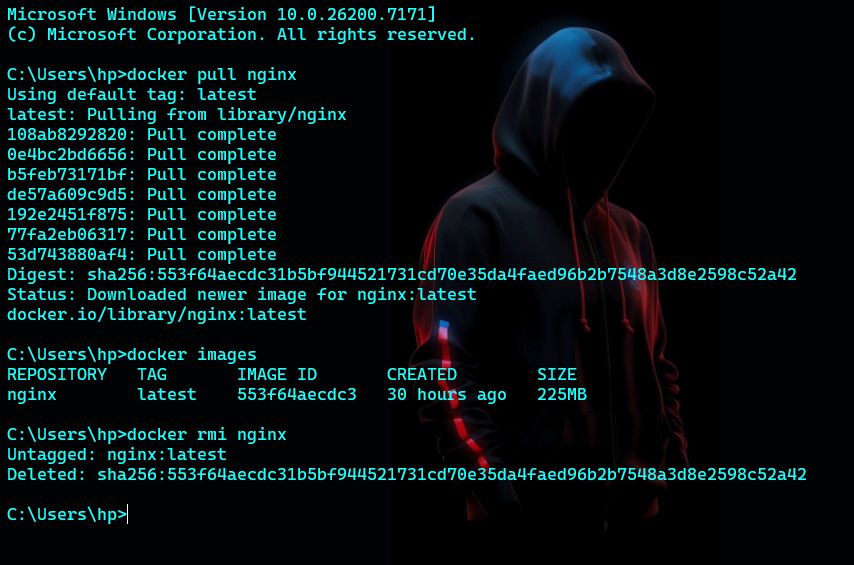
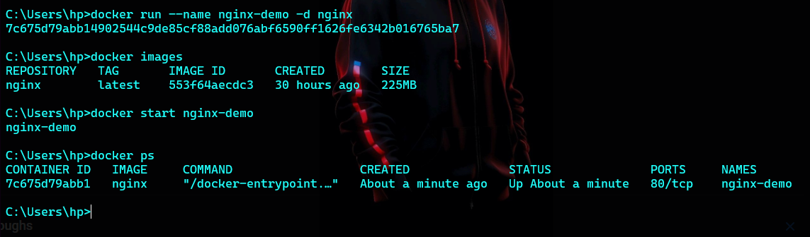

# Docker command

### pull nginx image
```bash
docker pull nginx
```

### run nginx container
```bash
docker run --name mynginx -d -p 8080:80 nginx
```
### stop nginx container
```bash
docker stop mynginx
```
### remove nginx container
```bash
docker rm mynginx
```

### remove nginx image
```bash
docker rmi nginx
```
### list all containers
```bash
docker ps -a
```
### list all images
```bash
docker images
```
### view logs of a container
```bash
docker logs mynginx
```
### execute a command inside a running container
```bash
docker exec -it mynginx /bin/bash
```
### view container details
```bash
docker inspect mynginx
```


